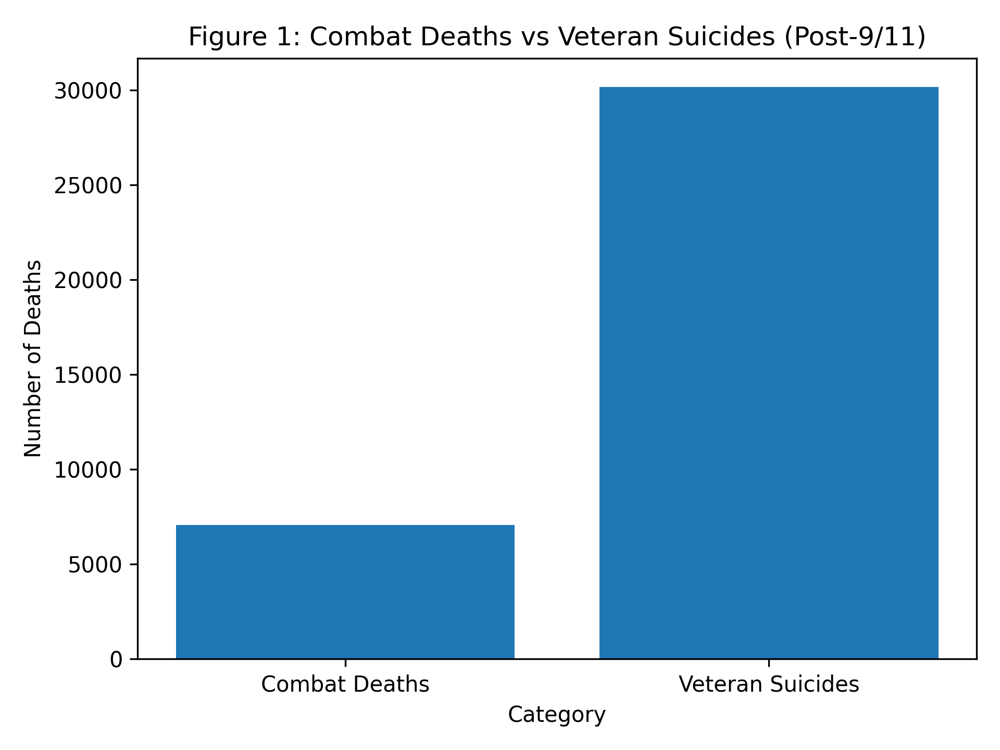
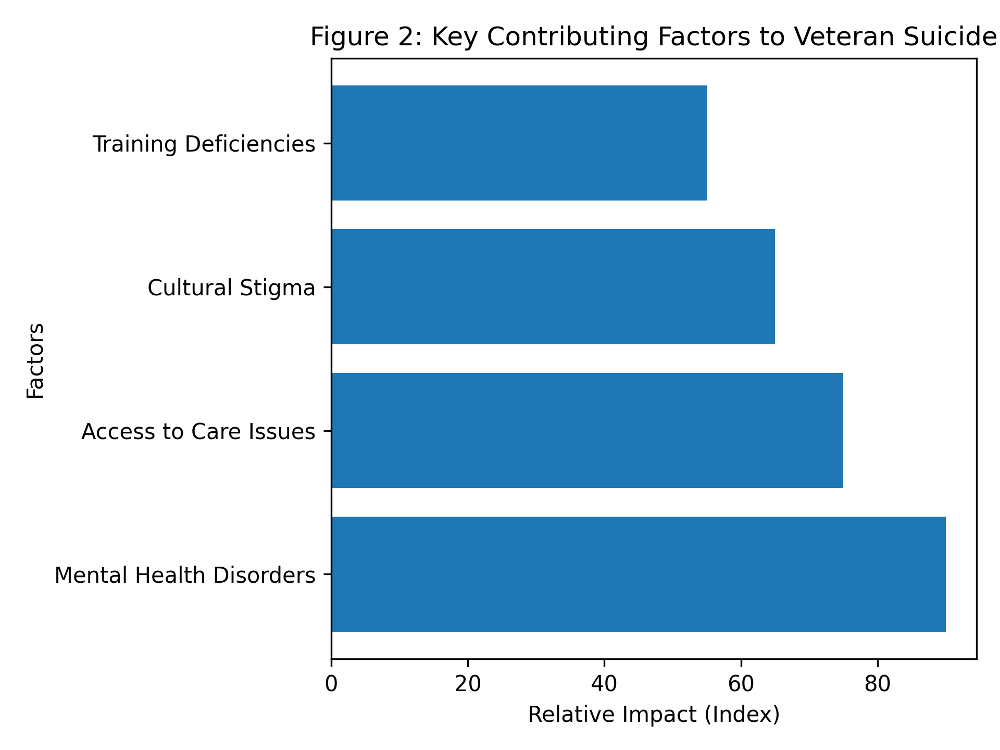

# Improving Mental Health Outcomes in Veteran Assistance Programs

## A Technical Report

---

## Abstract

Veteran suicide remains a significant public health concern in the United States, driven largely by untreated mental health conditions such as post-traumatic stress disorder (PTSD) and depression. This report evaluates systemic gaps in veteran assistance programs, including limited staffing, insufficient pre-deployment mental health training, and lack of integrated care systems.

Using existing research and statistical data, this report proposes actionable recommendations such as early psychological screening, expanded clinical staffing, and improved coordination between the Department of Defense (DoD) and Veterans Health Administration (VHA). These measures aim to reduce suicide rates and improve long-term outcomes for veterans.

---

## 1. Introduction

Veteran suicide has emerged as a critical issue within the United States, with rates significantly exceeding combat-related deaths since 9/11. Mental health challenges, including PTSD, depression, and reintegration difficulties, are key contributing factors.

Despite the presence of institutional support systems such as the VA, gaps in accessibility, staffing, and training persist.

### Research Question

How can veteran assistance programs improve mental health care delivery to reduce depression, PTSD, and suicide among veterans?

---

## 2. Background

Research indicates that mental health disorders are the leading contributors to suicide among veterans. Reintegration into civilian life introduces additional stressors, including social isolation and identity challenges.

---

## 3. Contributing Factors

### 3.1 Systemic Limitations

- Insufficient staffing in VA programs
- Delayed access to care
- Limited crisis intervention services

### 3.2 Training Gaps

- No mandatory psychological evaluation prior to deployment
- Minimal mental health training during boot camp

### 3.3 Cultural Barriers

- Stigma surrounding mental health
- Reluctance to seek help

### 3.4 Data Limitations

- Incomplete national reporting of veteran suicides
- Common statistics may underestimate actual rates

---

## 4. Data Visualization

### Table 1 — Comparison of Combat Deaths vs Veteran Suicides (Post-9/11)

| Category | Estimated Deaths |
|---|---|
| Combat Deaths | 7,057 |
| Veteran Suicides | 30,177 |

*Note. Data adapted from Hernandez (2021).*

---

## Figure 1 — Combat Deaths vs Veteran Suicides

!
---

## Figure 2 — Key Contributing Factors to Veteran Suicide

The diagram illustrates that untreated mental health conditions are the most significant contributing factor to veteran suicide, with access to care limitations and cultural stigma also playing substantial roles.

Training deficiencies further compound these issues by preventing early identification and intervention, highlighting the need for systemic improvements across multiple levels of support.

---

## 5. Analysis of Current Programs

### Strengths

- Established VA infrastructure
- Availability of veteran support programs

### Weaknesses

- Overburdened healthcare systems
- Limited coordination between DoD and VHA
- Lack of trained mental health professionals in community programs

---

## 6. Recommendations

### 6.1 Pre-Deployment Mental Health Training

- Mandatory psychological evaluations
- Resilience and coping strategy education

### 6.2 Expanded Clinical Staffing

- Increase number of licensed mental health providers
- Embed psychologists in veteran-run programs

### 6.3 Integrated Care Systems

- Shared medical records between DoD and VHA

### 6.4 Improved Accessibility

- Expand eligibility for mental health services
- Increase inpatient and outpatient program availability

### 6.5 Preventative Therapies

- Promote mindfulness, meditation, and post-traumatic growth strategies

---

## 7. Discussion

The findings suggest that early intervention and systemic reform are essential to reducing veteran suicide rates. Addressing both institutional and cultural barriers will improve treatment accessibility and outcomes.

---

## 8. Conclusion

Veteran suicide is preventable through improved mental health infrastructure, early intervention strategies, and cultural change. Implementing these recommendations can significantly reduce suicide rates and enhance quality of life for veterans.

---

## References

Ahlin, E. M., & Douds, A. S. (2018). *Many Shades of Green: Assessing Awareness of Differences in Mental Health Care Needs among Subpopulations of Military Veterans.*

Hernandez, J. (2021). *Since 9/11, Military suicides are 4 times higher than deaths in war operations.* NPR.

Jones, A. (2020). *Hold Your Position.* AJ Impacts.

McKinney, J. M., Hirsch, J. K., & Britton, P. C. (2017). *PTSD symptoms and suicide risk in veterans.*

Shane, L., & Kime, P. (2017). *New VA study finds 20 veterans commit suicide each day.* Military Times.

TEDxTalks. (2016). *How to End Veteran Suicides.*